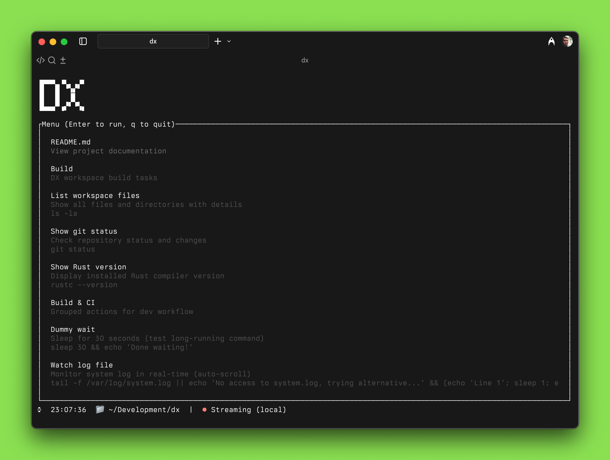

# dx — Terminal DX



> Before we chase superintelligence, let’s conquer keystrokes. Speech-to-text and agents paved the way; we’ll push it further.

### Vision
What Cursor is for professional coding, and Bolt/Lovable are for vibe‑coding, DX aspires to be for the terminal: a fast, trustworthy runner that turns docs into do‑ables.

## Why teams use dx
- Zero-setup terminal onboarding: open a repo, get a guided menu and MOTD
- One file to rule them all: `dx.(toml|yaml|json)` drives tasks, demos, runbooks
- Bring your own format: TOML/YAML/JSON menus, Markdown docs/MOTD — no lock-in
- Security & transparency: inspectable installer, plain-text menus, no daemons, no root required
- Command acceptance & safeguards: explicit run by Enter, full command visible, kill confirm, safe external return
- Hybrid output view: colors, spinner, timer, auto-scroll, markdown toggles
- External run mode: drop to your shell transparently, then snap back to dx
- Asciinema built-in: record or go live (`dx --live`), with auto filenames and badges
- Clickable docs: Markdown footnotes become navigable links (1–9, mouse)
- Clean UX: consistent layout, keyboard-first, mouse-friendly, gentle confirmations
- Config simplicity: sensible defaults, optional local/global `config.toml`
- Single static binary: fast startup, no runtime deps; Linux/macOS

> Install in 10s:
```bash
curl -fsSL https://usedx.sh | sh
```

Developer-first CLI/TUI that turns your README, runbooks and scripts into a focused terminal experience:
- Scrollable Markdown/ASCII viewer (MOTD + files)
- Command menu powered by `dx.toml`
- Live command output with colors, spinner, timer, and exit summary
- Interactive stdin (prompts), kill with confirmation
- Mouse scroll, clickable Markdown footnotes, link navigation (1–9)
- Smart layout: MOTD on top, output view below, optional status line at bottom

This is the open‑source core. No telemetry. Single static binary.

---

## Quick install (Linux/macOS)

### A) One‑liner (inspectable installer)
```bash
curl -fsSL https://usedx.sh | sh
# non-interactive: curl -fsSL https://usedx.sh | sh -s -- -y
```
The installer script is plain text and hosted at `https://usedx.sh/install` (GitHub Pages) — inspect before running.
- Detects OS/arch, verifies SHA256, asks before using `sudo`, falls back to `~/.local/bin`.
- Flags: `-y/--yes`, `--version vX.Y.Z`, `--bin-dir DIR`, `--no-modify-path`, `--uninstall`.

### B) Direct download
```bash
# macOS (Apple Silicon)
sudo curl -fsSL https://usedx.sh/dl/dx-darwin-arm64 -o /usr/local/bin/dx && sudo chmod +x /usr/local/bin/dx
# macOS (Intel)
sudo curl -fsSL https://usedx.sh/dl/dx-darwin-amd64 -o /usr/local/bin/dx && sudo chmod +x /usr/local/bin/dx
# Linux (x86_64)
sudo curl -fsSL https://usedx.sh/dl/dx-linux-amd64 -o /usr/local/bin/dx && sudo chmod +x /usr/local/bin/dx
```
Pathless install (no sudo) to `~/.local/bin`:
```bash
mkdir -p "$HOME/.local/bin"
curl -fsSL https://usedx.sh/dl/dx-linux-amd64 -o "$HOME/.local/bin/dx" && chmod +x "$HOME/.local/bin/dx"
```

---

## One‑liner bootstrap (demo)
Creates a minimal `dx.toml`, `MOTD.md`, and runs `dx`.
```bash
sh -c '
set -e
mkdir -p demo-dx && cd demo-dx
cat > MOTD.md <<"MOTD"
<!-- dx:ascii -->
████╗   ████╗
Welcome to dx demo
MOTD
cat > dx.toml <<"MENU"
[[items]]
name = "Show Git status"
description = "git status in the current repo"
cmd = "git status || echo 'Not a git repo'"

[[items]]
name = "README.md"
description = "View local README (Markdown)"
file = "README.md"
MENU
cat > README.md <<"DOC"
# Demo README

- Use Up/Down / j/k to move
- q or Esc to quit
DOC
dx
'
```

---

## Local Development

For development builds, use the included install script:

```bash
# Build and install to ~/.local/bin (recommended)
./install.sh

# Uninstall
./uninstall.sh
```

The install script:
- Builds the project in release mode
- Copies the binary to `~/.local/bin/dx` (which is already in your PATH)
- Overwrites any existing installation
- Is more reliable than symlinks

---

## Usage

```bash
dx                # auto-detects dx.toml and MOTD.md
# or
dx README.md      # open a file directly
```

Keys (output view):
- j/k, ↑/↓, PgUp/PgDn, g/G: scroll
- a: toggle auto‑scroll to bottom
- d: dim/undim baseline text
- m: render Markdown on/off (per file)
- w: wrap on/off (helps ASCII art)
- Ctrl+C: kill running process (mini‑modal confirm with Enter/Esc)
- b or Backspace: back to menu (if available)
- q / Esc: quit (with confirm if a process is running)

Keys (menu):
- Up/Down or j/k: select
- Enter: run/open
- q, Esc, Ctrl+C, Ctrl+Q: quit immediately
- :q Enter: vim‑style quit
- Mouse wheel: scroll selection

---

## Config files

### dx.(toml|yaml|json) (commands & files)
```toml
[[items]]
name = "List files"
description = "ls -la of current directory"
cmd = "ls -la"

[[items]]
name = "README.md"
description = "View project README"
file = "README.md"
```
- `cmd` runs via `/bin/sh -c` (stdin supported; Ctrl+C kills)
- `file` opens a local file (Markdown rendered; toggle with `m`/`w`)

### MOTD.md (top banner)
- Rendered above the main window
- To force raw ASCII (no markdown), add a marker line:
```markdown
<!-- dx:ascii -->
```

### config.toml (quick reference)

| Key | Scope | Type | Default | Description |
|---|---|---|---|---|
| allow_project_override | global | bool | true | Allow local `./config.toml` to override global `~/.dx/config.toml`. |
| motd_wrap | both | bool | true | Soft-wrap MOTD markdown. |
| markdown_enabled | both | bool | true | Render markdown (globally). |
| output_dim | both | bool | true | Dim baseline text in output view. |
| theme | both | "dark"/"light" | "dark" | Base color theme. |

| [status] | Scope | Type | Default | Description |
|---|---|---|---|---|
| text | both | string | — | Static status line text. |
| command | both | string | — | Command printing one-line updates to status bar. |

| [asciinema] | Scope | Type | Default | Description |
|---|---|---|---|---|
| enabled | both | bool | false | Enable recording/streaming integration. |
| external | both | bool | false | Wrap external menu commands under asciinema. |
| on_relaunch | both | bool | false | Wrap auto‑relaunch session under asciinema. |
| dir | both | string | — | Output directory for `.cast` files. |
| file_prefix | both | string | "dx" | Filename prefix (dx-<unix_ts>.cast). |
| title | both | string | — | Recording/stream title. |
| quiet | both | bool | false | Pass quiet flag. |
| overwrite | both | bool | false | Pre-delete existing `.cast` before record. |
| stream | both | bool | false | Use live streaming instead of recording. |
| stream_mode | both | "remote"/"local" | "remote" | Streaming target mode. |
| local_addr | both | string | — | For local mode: `IP:PORT` (optional). |
| remote | both | string | — | For remote mode: stream ID or WS URL. |

| [update] | Scope | Type | Default | Description |
|---|---|---|---|---|
| on_start | both | bool | false | Build then relaunch DX on startup. |
| build_cmd | both | string | "cargo build --release" | Command used for build. |
| relaunch_path | both | string | "target/release/dx" | Executable used for relaunch. |
| preserve_args | both | bool | true | Reuse current CLI args on relaunch. |

| [telemetry] | Scope | Type | Default | Description |
|---|---|---|---|---|
| enabled | both | bool | false | Enable sending failed command logs. |
| endpoint | both | string | — | HTTP endpoint for telemetry POST. |

---

## Features in detail

- Markdown viewer
  - Headings/colors, lists, code blocks, rules, task lists
  - Clickable footnotes at document bottom; press 1–9 to open linked local `.md`
  - Toggles: `m` (render on/off), `w` (wrap on/off), `a` (auto‑scroll)
- Command runner
  - ANSI colors preserved, interactive stdin, spinner, timer, live scroll
  - Mini‑modal confirm on quit/kill; green/red/magenta summary line at end
- Menu UX
  - Clean 2‑line item (title + dimmed description), full‑row highlight
  - Internal left/right padding; extra spacing between options
  - Universal exits: q, Esc, Ctrl+C, Ctrl+Q; `:q` Enter
- Status line
  - Static text or live command output; updates as the command prints

---

## License
MIT (or your preferred permissive license).
